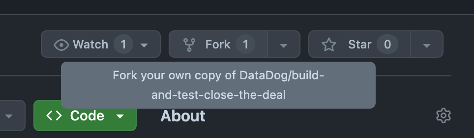

# Close the deal exercise

## 1. Test Visibility

Find how to setup this project.

### Fork repository

First thing is to fork this repository:

It's important that you fork into the **DataDog** namespace. Choose a name like `build-and-test-close-the-deal-$YOUR_NAME`.

Keep the repository page open in a tab at all times.

### Set `DD_API_KEY` as secret in your repository.

- Go to https://app.datadoghq.com
- Press Cmd + K.
- Type API Keys in the modal.
- Search for "CI Visibility - test environment".
- Click on "Copy"
- Go to https://github.com/DataDog/$YOUR_REPOSITORY/settings/secrets/actions
- Select "Secrets and Variables" -> "Actions".
- Click on "New repository secret".
- Name must be `DD_API_KEY`.
- Secret must be the value you just copied.
- Go to "Actions": enable GHA workflows.
- Now go back to the in app onboarding.

### Follow the in app onboarding

- Go to https://app.datadoghq.com/ci/setup/test and follow the instructions.
- Do **not** select the type of CI provider we're using.
- Test framework: Jest.
- Write your `DD_ENV`: use something that identifies you, such as "test-juan".
- Set `DD_SERVICE` to `close-the-deal-tests`.

### Enable Intelligent Test Runner

- Activate the toggle.
- Set the repository URL. It should have this shape: https://github.com/DataDog/$YOUR_REPOSITORY
- Select "main" as default branch.
- Click on "Save".

### Enable GitHub PR comments

- Activate the toggle.
- Click on "Save".

### Enable Early Flake Detection

- Activate the toggle.
- Select "main" as default branch.

### Change your GHA workflow

- Scroll up to the "Run your tests" section.
- Copy the snippet of code at the right side.
- Go to [test.yml](./.github/workflows/test.yml) and substitute the "Run tests" step's current command by the snippet.
- **IMPORTANT**: Make sure you are not committing any API Key.
- Commit directly to main.

### See results in Datadog

- Go to https://app.datadoghq.com/ci/test-services
- Select your env (`DD_ENV` value) from the dropdown.
- Click on the test service.

## 2. Intelligent Test Runner

We're going to test Intelligent Test Runner's capability to skip tests by modifying a file that's used by a single test.

- Modify [array.js](./src/array.js) by uncommenting the line following the comment in `calculateAverage`.
- Commit changes in a _different_ branch from the default branch. You can use `feature-branch-itr` or something similar.
- See Intelligent Test Runner savings in the branch page.

## 3. Early Flake Detection

We're going to test Early Flake Detection's capability to detect flakiness early.

- Modify [array.test.js](./tests/array.test.js) by uncommenting the last test
- Commit changes in a _different_ branch from the default branch. You can use `feature-branch-efd` or something similar.
- See flakiness being detected in the branch page.
